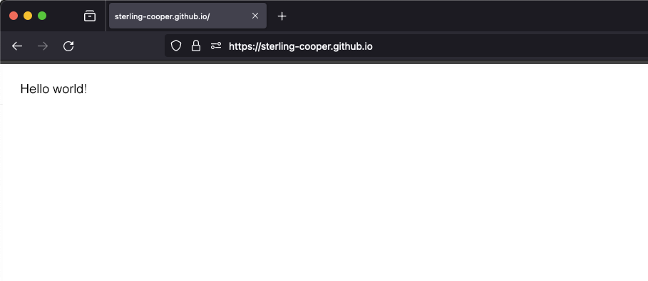
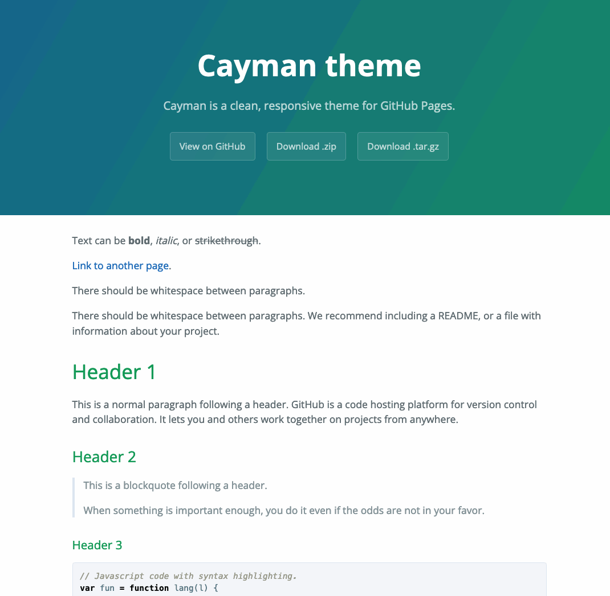

# Choosing a Tool for Blogging

Choosing the medium for my reflective blog turned into an unexpectedly fun exercise, and an interesting subject for my first post! Rather than present an exhaustive technical guide, what follows are some notes on how the blog evolved and what I learned from the process.

## Picking a host

At first glance, potential hosts like WordPress and Google Sites seemed to fufill all the requirements. However, I also had a feeling that I would never use either of these platforms beyond the completion of the assignment. I decided to look a little further afield, and in doing so remembered **Github Pages**:

> "GitHub Pages is a static site hosting service that takes HTML, CSS, and JavaScript files straight from a repository on GitHub, optionally runs the files through a build process, and publishes a website" (About GitHub Pages n.d.).

This immediately appealed to me because I’m familiar with Github $^1$, Markdown $^2$, and I have a longstanding wish to learn more about the docs-as-code $^3$ mindset. Intrigued, I decided to dip my toe in the water and follow the five-step introduction on [pages.github.com](https://pages.github.com/). A couple of minutes later, I had my very own website!




## Selecting a theme

Encouraged, I ventured a little further down the rabbit hole. The next item on my to-do list was to write out a full list of requirements for the site. Of course, I completely ignored this step and started giddily playing with the array of pre-built [themes](https://pages.github.com/themes/).



An unspecified amount of time disappeared before I settled on [Minima](https://github.com/jekyll/minima). As the name suggests, it’s simple, clean, and has a familiar layout that is in keeping with other popular technical writing blogs. 

## Building with Jekyll

Each of these themes is powered by [Jekyll](https://docs.github.com/en/pages/setting-up-a-github-pages-site-with-jekyll/about-github-pages-and-jekyll), a simple, blog-aware, static site generator (Jekyll n.d.). Simplicity is the key term here. Tom Preston-Werner (2008) created Jekyll to keep the complexity of blogging to an absolute minimum. Jekyll takes content written in markdown, mixes in any user-defined configuration settings, and generates a complete static website, ready to be served. GitHub Pages serves the website directly from my GitHub repository so that I don’t have to deal with any hosting.

To get this far, I only needed a page for my "Hello World" markdown (`index.md`) and my own configuration file (`_config.yml`).

###### Blog root directory:
```
sterling-cooper.github.io
├── _config.yml
├── index.md
```
The `_config.yml` couldn't be simpler, its only entry was to specify the theme:
```
theme: "minima"
```

Now, about those requirements!

> **&#9745; Requirement:** The blog needs to be accessible to my instructor.
By setting my repository to be “public”, the website is viewable on the open internet.

> **&#9745; Requirement:** The blog needs to have a landing page.
My prototype has an index.md that serves as a home page for the blog.

That’s a nice start, but it’s not much of a blog without posts!

## Creating a blog post

I quickly realised that blogging really is baked into Jekyll, because all I needed to do to post my first blog was create a directory called `_posts` and add a new file to it called `2024-02-06-choosing-a-tool-for-blogging.md`. This filename format is important for Jekyll to recognise the file as a post. More details [here](https://jekyllrb.com/docs/posts/).

###### Blog root directory:
```
sterling-cooper.github.io
├── _posts
    └── 2024-02-06-choosing-a-tool-for-blogging.md
├── _config.yml
├── index.md
```

## Comments

Commenting on posts is not supported out-of-the box, and it was not immediately obvious to me how to allow readers to comment. A little webcrawling led me to [this helpful post](https://webapps.stackexchange.com/questions/165528/how-to-add-comments-in-blog-posts-on-github-pages-websites) and an open-source tool called [utterances](https://utteranc.es/). With a little trial and error, a **lot** of help from the aforementioned link, I realise that I need to add a little bit of code to each post:
```
<script src="https://utteranc.es/client.js"
        repo="Sterling-Cooper/sterling-cooper.github.io"
        issue-term="title"
        theme="github-light"
        crossorigin="anonymous"
        async>
</script>
```
Rather than do this for each individual page, I experimented with creating a `_layouts` directory and adding a default arrangement for each post that will include this snippet.
###### Blog root directory:
```
sterling-cooper.github.io
├── _layouts
    └── post.html
├── _posts
    └── 2024-02-06-choosing-a-tool-for-blogging.md
├── _config.yml
├── index.md
```
This allows the user to leave a comment on each post, with the small caveat that they must already logged be into Github—registration is free, no catch! The comments appear as issues in the Github repository, which I can also delete, effectively allowing the owner to moderate the discussion, which I see as a plus. 

> **&#9745; Requirement:** One of the characteristics of a blog is that readers can comment on blog entries.

## Blogs I Follow

Within the blog, I should be able to build up a list of links to other blogs and websites on relevant topics. I initially experimented with adding this list as its own blog post, and alternatively as a table in the landing page, but neither result felt natural. Going back to the theme configuration in `_config.yml`, I realised there is a setting to add a page to the permanent header. Creating a new page for the list of blogs and linking it in the header gives the list its own space and keeps it discoverable. All I needed to do was create a page (`follow.md`) and add it to the `_config.yml` under `header_pages`:
###### Blog root directory:
```
sterling-cooper.github.io
├── _layouts
    └── post.html
├── _posts
    └── 2024-02-06-choosing-a-tool-for-blogging.md
├── _config.yml
├── index.md
├── follow.md
```
```
header_pages:
  - follow.md
```

## Bells and whistles

At this point I was optimistic that Github Pages was going to meet the core requirements of the assignemnt. And since I had now tumbled all the way down the rabbit hole, I decided to lean into the other features of a blog. All pages are going to include some common components, which can be grouped in a directory called `_includes`. 

Most obviously, each page in the blog should have a header that displays the title of the blog and contain some information about how the page is displayed — `head.html`.

Once a user has clicked on a post, many blogs allow the user to allow the user to share the blog through email or social media  — `sharelinks.html`.

It’s also common for blogs to skip forward to the previous/next blog in chronological order — `navlinks.html`. These links will require a little extra formatting, which can done by tweaking the css — `css/override.css`.
###### Blog root directory:
```
sterling-cooper.github.io
├── _includes
    └── head.html
    └── navlinks.html
    └── sharelinks.html
├── _layouts
    └── post.html
├── _posts
    └── 2024-02-06-choosing-a-tool-for-blogging.md
├── css
    └── override.css 
├── _config.yml
├── index.md
├── follow.md
```

## Tags and regrets

> _“Assumptions are dangerous things to make, and like all dangerous things to make, bombs, for instance, or strawberry shortcake, if you make even the tiniest mistake you can find yourself in terrible trouble.”_ – Lemony Snicket 

To this point I assumed that adding categories or tags to organise blog posts would be trivial. An increasingly panicked websearch led me to understand that is not supported by Github Pages. The blood only starts returning to my face when I discover this wonderful post on [how to implement Jekyll tags on github pages](https://tainenko.github.io/jekyll-tag-on-github-pages/). From this I learn that I need to add a new file called `collecttags.html` to my `_includes` directory to collect all the tags from my site into a list called `site.tags`. This collection needs to run from `head.html`, where Jekyll defines the header. 

Once the list of tags is known, they can be displayed at the bottom of each post by adding that section to `_layouts/post.html`. Each tag needs a corresponding markdown file, and these will be collected in the `tag` directory.

When a user clicks the link on a tag, they will expect a different layout to a regular post. `_layouts/tagpage.html` describes a clean page with a list of relevant blog posts, without the extra bells and whistles of a regular blog post.

> **&#9745; Requirement:** Include a Categories or Tags widget to organise blog posts.

The final root directory for the prototype blog:
###### Blog root directory:
```
sterling-cooper.github.io
├── _includes
    └── collecttags.html
    └── head.html
    └── navlinks.html
    └── sharelinks.html
├── _layouts
    └── post.html
    └── tagpage.html
├── _posts
    └── 2024-02-06-choosing-a-tool-for-blogging.md
├── css
    └── override.css
├── tag
├── _config.yml
├── index.md
├── follow.md
```

## Conclusions

Final scare notwithstanding, this was actually quite a fun exercise. In an existence increasingly dominated by meetings, it was great to dust off the coding side of my brain and try solve a few problems!

The Continuous Integration $^4$ aspect of building Github Pages is really interesting, and I've only just scratched the surface. Definitely something I will keep building on beyond this assignment!

## Footnotes

$^1$ Github is a popular code sharing and collaboration service owned by Mircosoft (Lardinois and Lunden 2018).

$^2$ Markdown is a text-to-HTML conversion tool for web writers. The idea is that a Markdown-formatted document should be publishable as-is, as plain text, without looking like it’s been marked up with tags or formatting instructions (Gruber 2004). 

$^3$ Docs-as-code is a way to integrate development and documentation teams and produce high-quality documentation for software products.

$^4$ Continuous Integration is a software development practice where each member of a team merges their changes into a codebase together, and all of these merges are verified by an automated build (including test) to detect integration errors as quickly as possible (Fowler 2004).

## References

_About Github Pages_ (n.d.) docs.github.com, available:
https://docs.github.com/en/pages/getting-started-with-github-pages/about-github-pages [accessed 10 Feb 2024].

Fowler, M. (2004) _Continuous Integration_, martinfowler.com, https://martinfowler.com/articles/continuousIntegration.html [accessed 10 Feb 2024].

Gentle, A. (2022) _Docs Like Code: Collaborate and Automate to Improve Technical Documentation_, 3rd ed., Austin: Lulu.

Gruber, J. (2004) _Markdown_, Daring Fireball, available: https://daringfireball.net/projects/markdown/ [accessed 10 Feb 2024].

_Jekyll_ (n.d.) github.com, available: https://github.com/jekyll/jekyll [accessed 10 Feb 2024].

Lardinois, F. and Lunden, I. (2018) _Microsoft has acquired GitHub for $7.5B in stock_, TechCrunch, available: https://techcrunch.com/2018/06/04/microsoft-has-acquired-github-for-7-5b-in-microsoft-stock/ [accessed 10 Feb 2024].

Preston-Werner, T. (2008) _Blogging Like a Hacker_, tom.preston-werner.com, available: https://tom.preston-werner.com/2008/11/17/blogging-like-a-hacker.html [accessed 10 Feb 2024].

  <script src="https://utteranc.es/client.js"
          repo="Sterling-Cooper/sterling-cooper.github.io"
          issue-term="title"
          theme="github-light"
          crossorigin="anonymous"
          async>
  </script>
